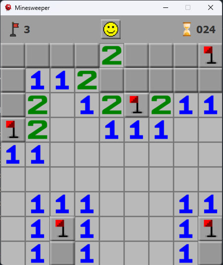
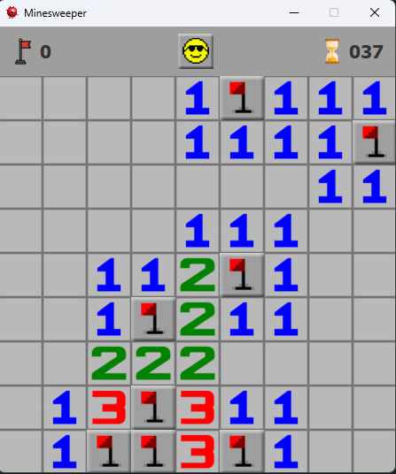
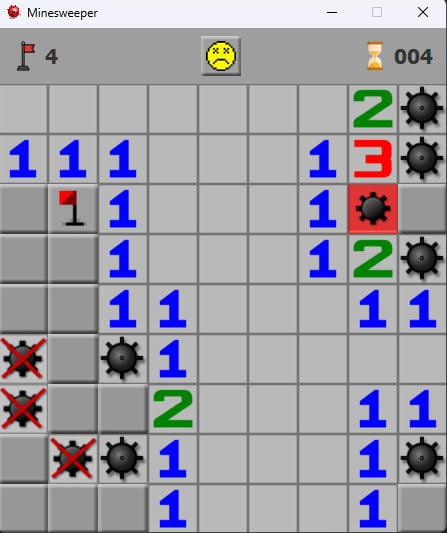

  

<h3 align="center">‎‎‎‎‎Minesweeper</h3>

## 📖 Description
**Minesweeper** is a classic logic game created as part of the first practical project. The goal is to reveal all cells on the board without triggering any mines.
In this version, the board contains **8 mines**. Players can use flags to mark suspected mines, and numbers on opened cells show how many mines are adjacent to that cell.

## 🕹️ Game functions
- Reveal cells on the board  
- Place and remove flags on suspected mines  
- Reveal all adjacent cells if the correct number of flags is placed around a numbered cell  
- Restart the game at any time  
- End the game manually  
- Win by opening all safe cells  
- Lose if you click on a mine

## 🎮 Controls
- **Left Click** – reveal a cell  
- **Right Click** – place or remove a flag

## 🖼 Screenshots

  
  
  

> [!IMPORTANT]
> Key information users need to know to achieve their goal.

